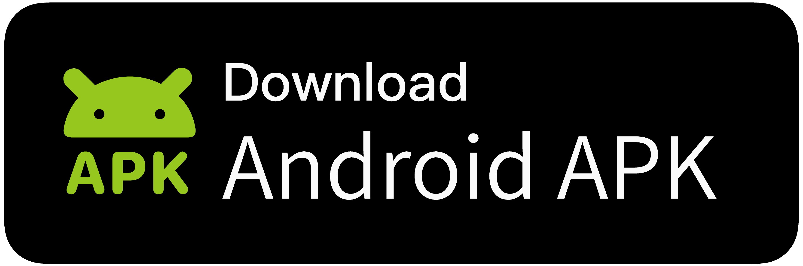

# Fread

Fread is a decentralized microblogging client that seamlessly integrates Mastodon, Bluesky, and RSS — all in one place. 

<p align="center">
  <a href="https://play.google.com/store/apps/details?id=com.zhangke.fread">
    
  </a>
  <a href="https://f-droid.org/packages/com.zhangke.fread/">
    
  </a>
  <a href="https://github.com/0xZhangKe/Fread/releases/latest">
    
  </a>
</p>

or download it in [Release page](https://github.com/0xZhangKe/Fread/releases)

 - `fread-xxx-google-play-signed.apk`: Signed by Google Play and includes push notifications. If you are used to updating through Google Play, you can choose this version.
 - `fread-xxx-fdroid.apk`: The version available on F-Droid does not include push notifications, and its signature is inconsistent with Google Play. If you are used to using F-Droid, please use this version.
 - `fread-xxx-fdroid.apk`: Test version, contains some logs, the functionality is the same as the Google Play version, but the signature is the same as F-Droid.

Because Fread accidentally used Google Play managed signatures, there are currently two different signed versions of Fread distributed. **These two versions cannot be upgraded to each other**. Please choose with caution.

## Screenshots


## Build
The signing key is required, or you can simply delete the signing configuration in app/build.gradle to complete the compilation.

### Build disable firebase
Manually disable Firebase join compilation
```
./gradlew assembleRelease -PdisableFirebase=true
```
## Blogs
- [Why Open Source](https://medium.com/@kezhang404/after-two-years-of-development-the-fread-project-is-now-open-source-8adcf690bfac)
- [Support Bluesky](https://medium.com/@kezhang404/fread-now-supports-bluesky-a-unified-gateway-to-the-decentralized-web-17f518ba877c)
- [Fread Introduce](https://medium.com/@kezhang404/fread-the-next-generation-mastodon-client-30bc50e279fd)
- [The Philosophy of Modular Division in a Large Android Project
](https://medium.com/@kezhang404/the-philosophy-of-modular-division-in-a-large-android-project-e588a5dcdb78)

[**Deepwiki**](https://deepwiki.com/0xZhangKe/Fread)

## Star History

[](https://www.star-history.com/#0xZhangKe/Fread&Date)

## Discussion Group
- [Telegram](https://t.me/+-SlbKcNbJSphNWI1)

## Official Account
- [Mastodon](https://mastodon.social/@fread)

## Donate
[Ko-Fi](https://ko-fi.com/zhangke) or [Afdian](https://afdian.com/a/_0cdc1)
