# Kotlin-Inject Dependency Graphs

Notes:
- Sources: Kotlin files with `@Inject`, `@Provides`, or `@Component` annotations across all modules and source sets.
- Arrow direction: dependency -> dependent (top to bottom).
- `External:` nodes represent assisted inputs or values not bound in the same source set graph.

## androidMain

Roots (no dependencies):
- Activity
- ApplicationContext
- RssParser



```mermaid
flowchart TB
  Necfc2dffe5["Activity"]
  Nb642dc2e53["ActivityPubDatabases"]
  Nd6c6a6bb97["ActivityPubLoggedAccountDatabase"]
  Ne582c54210["ActivityPubStatusDatabases"]
  N4b0697a4f6["ActivityPubStatusReadStateDatabases"]
  N8d5906e226["ApplicationContext"]
  N9be163fa87["BlueskyLoggedAccountDatabase"]
  Nebba756115["ContentConfigDatabases"]
  Ne1d90545f7["External: ActivityPubClientManager"]
  Na5181cbba3["External: ActivityPubLoggedAccountRepo"]
  N1a7b1cc6f8["External: AndroidApplicationComponent"]
  N4394529ff6["External: AndroidSystemBrowserLauncher"]
  N0cfc9f656b["External: Application"]
  N5e8baaa3bb["External: ApplicationCoroutineScope"]
  Nc3ea95cd13["External: ComponentActivity"]
  N7d16a1d3d9["External: DayNightHelper"]
  Ne47295ccce["External: FeedsRepoModuleStartup"]
  Nc1a3aa7b35["External: FreadConfigManager"]
  N2edcc08008["External: LanguageHelper"]
  Ne5a922a653["External: LanguageModuleStartup"]
  N956e808f53["External: LocalConfigManager"]
  N3f61db1662["External: StorageHelper"]
  Nade7b46a17["External: TextHandler"]
  N0c2f18938e["FlowSettings"]
  Nbeb46cbb74["FreadContentDatabase"]
  Nbee06c41c2["ImageLoader"]
  N316a667bb3["MixedStatusDatabases"]
  Nded7da349d["ModuleStartup"]
  Na3291e7bfa["NotificationsDatabase"]
  Ne5814d179d["OldFreadContentDatabase"]
  N010a4e8c92["PushInfoDatabase"]
  N9671344cf0["PushInfoRepo"]
  N88f2708bac["RssDatabases"]
  N33e9b1425c["RssParser"]
  N18af4a5dbc["SelectedAccountPublishingDatabase"]
  N6bb8cf23c8["SystemBrowserLauncher"]
  Na773e1b613["com.zhangke.fread.activitypub.app.internal.push.ActivityPubPushManager"]
  Ncd90060920["com.zhangke.fread.activitypub.app.internal.push.notification.PushNotificationManager"]
  N1c6b36a398["com.zhangke.fread.common.browser.AndroidSystemBrowserLauncher"]
  Nad842ac95b["com.zhangke.fread.common.browser.BrowserBridgeDialogActivityComponent"]
  N227f594a4d["com.zhangke.fread.common.browser.OAuthHandler"]
  N05a4c3e9fe["com.zhangke.fread.common.daynight.ActivityDayNightHelper"]
  N005b37105d["com.zhangke.fread.common.handler.ActivityTextHandler"]
  N039314d0f5["com.zhangke.fread.common.handler.TextHandler"]
  N13715080e6["com.zhangke.fread.common.language.ActivityLanguageHelper"]
  N53c4ecbc13["com.zhangke.fread.common.language.LanguageHelper"]
  Na893363c04["com.zhangke.fread.common.startup.LanguageModuleStartup"]
  N399ea0e365["com.zhangke.fread.common.utils.MediaFileHelper"]
  N7e131d7774["com.zhangke.fread.common.utils.PlatformUriHelper"]
  N82c109ec61["com.zhangke.fread.common.utils.StorageHelper"]
  N21e10f71ca["com.zhangke.fread.common.utils.ThumbnailHelper"]
  Nef22c2fc33["com.zhangke.fread.common.utils.ToastHelper"]
  N6d0399996e["com.zhangke.fread.di.AndroidActivityComponent"]
  N7a66505a85["com.zhangke.fread.di.AndroidApplicationComponent"]
  N1e131c0677["com.zhangke.fread.utils.ActivityHelper"]
  Necfc2dffe5 --> N1e131c0677
  N3f61db1662 --> Nbee06c41c2
  N0cfc9f656b --> N7a66505a85
  N1a7b1cc6f8 --> N6d0399996e
  Nc3ea95cd13 --> N6d0399996e
  Nc1a3aa7b35 --> Na773e1b613
  Ne1d90545f7 --> Na773e1b613
  N9671344cf0 --> Na773e1b613
  Na5181cbba3 --> Ncd90060920
  N8d5906e226 --> Nb642dc2e53
  N8d5906e226 --> Nd6c6a6bb97
  N8d5906e226 --> Ne582c54210
  N8d5906e226 --> N4b0697a4f6
  N8d5906e226 --> N010a4e8c92
  N010a4e8c92 --> N9671344cf0
  N8d5906e226 --> Na3291e7bfa
  N8d5906e226 --> N9be163fa87
  N4394529ff6 --> N6bb8cf23c8
  N4394529ff6 --> N6bb8cf23c8
  N8d5906e226 --> N039314d0f5
  Nade7b46a17 --> N005b37105d
  Necfc2dffe5 --> N005b37105d
  N2edcc08008 --> Na893363c04
  N8d5906e226 --> N0c2f18938e
  N8d5906e226 --> Nebba756115
  N8d5906e226 --> Nbeb46cbb74
  N8d5906e226 --> Ne5814d179d
  N8d5906e226 --> N316a667bb3
  Ne47295ccce --> Nded7da349d
  Ne5a922a653 --> Nded7da349d
  Nc3ea95cd13 --> Nad842ac95b
  N8d5906e226 --> N227f594a4d
  Necfc2dffe5 --> N1c6b36a398
  N7d16a1d3d9 --> N05a4c3e9fe
  Nc3ea95cd13 --> N05a4c3e9fe
  N956e808f53 --> N53c4ecbc13
  N0cfc9f656b --> N53c4ecbc13
  N2edcc08008 --> N13715080e6
  Nc3ea95cd13 --> N13715080e6
  N8d5906e226 --> N21e10f71ca
  N8d5906e226 --> N399ea0e365
  N5e8baaa3bb --> N399ea0e365
  N8d5906e226 --> N7e131d7774
  N8d5906e226 --> N82c109ec61
  Necfc2dffe5 --> Nef22c2fc33
  N8d5906e226 --> N88f2708bac
  N8d5906e226 --> N18af4a5dbc
```

## commonMain

Roots (no dependencies):
- ApplicationCoroutineScope
- IFeedsScreenVisitor
- IProfileScreenVisitor
- com.zhangke.fread.activitypub.app.ActivityPubContentManager
- com.zhangke.fread.activitypub.app.internal.adapter.ActivityPubApplicationEntityAdapter
- com.zhangke.fread.activitypub.app.internal.adapter.ActivityPubBlogMetaAdapter
- com.zhangke.fread.activitypub.app.internal.adapter.ActivityPubContentAdapter
- com.zhangke.fread.activitypub.app.internal.adapter.ActivityPubCustomEmojiEntityAdapter
- com.zhangke.fread.activitypub.app.internal.adapter.ActivityPubPollAdapter
- com.zhangke.fread.activitypub.app.internal.adapter.ActivityPubTagAdapter
- com.zhangke.fread.activitypub.app.internal.adapter.ActivityPubTranslationEntityAdapter
- com.zhangke.fread.activitypub.app.internal.adapter.PostStatusAttachmentAdapter
- com.zhangke.fread.activitypub.app.internal.adapter.RegisterApplicationEntryAdapter
- com.zhangke.fread.activitypub.app.internal.auth.LoggedAccountProvider
- com.zhangke.fread.activitypub.app.internal.repo.platform.MastodonInstanceRepo
- com.zhangke.fread.activitypub.app.internal.screen.status.post.adapter.CustomEmojiAdapter
- com.zhangke.fread.activitypub.app.internal.uri.PlatformUriTransformer
- com.zhangke.fread.activitypub.app.internal.uri.UserUriTransformer
- com.zhangke.fread.activitypub.app.internal.usecase.emoji.MapCustomEmojiUseCase
- com.zhangke.fread.bluesky.internal.adapter.BlueskyProfileAdapter
- com.zhangke.fread.bluesky.internal.content.BlueskyContentManager
- com.zhangke.fread.bluesky.internal.uri.platform.PlatformUriTransformer
- com.zhangke.fread.bluesky.internal.uri.user.UserUriTransformer
- com.zhangke.fread.bluesky.internal.usecase.GetAtIdentifierUseCase
- com.zhangke.fread.bluesky.internal.usecase.UpdateProfileRecordUseCase
- com.zhangke.fread.common.adapter.StatusUiStateAdapter
- com.zhangke.fread.common.bubble.BubbleManager
- com.zhangke.fread.common.deeplink.SelectedContentSwitcher
- com.zhangke.fread.common.onboarding.OnboardingComponent
- com.zhangke.fread.common.publish.PublishPostManager
- com.zhangke.fread.common.startup.FeedsRepoModuleStartup
- com.zhangke.fread.common.status.StatusIdGenerator
- com.zhangke.fread.common.status.StatusUpdater
- com.zhangke.fread.common.status.adapter.ContentConfigAdapter
- com.zhangke.fread.common.status.usecase.FormatStatusDisplayTimeUseCase
- com.zhangke.fread.commonbiz.shared.usecase.RefactorToNewBlogUseCase
- com.zhangke.fread.explore.screens.search.SearchViewModel
- com.zhangke.fread.explore.usecase.BuildSearchResultUiStateUseCase
- com.zhangke.fread.feeds.FeedsScreenVisitor
- com.zhangke.fread.rss.RssAccountManager
- com.zhangke.fread.rss.RssContentManager
- com.zhangke.fread.rss.RssNotificationResolver
- com.zhangke.fread.rss.RssPlatformResolver
- com.zhangke.fread.rss.RssPublishManager
- com.zhangke.fread.rss.internal.platform.RssPlatformTransformer
- com.zhangke.fread.rss.internal.source.RssSourceTransformer
- com.zhangke.fread.rss.internal.uri.RssUriTransformer
- com.zhangke.fread.rss.internal.webfinger.RssSourceWebFingerTransformer

```mermaid
flowchart TB
  N028b64f105["ApplicationCoroutineScope"]
  N2a8e209e43["BrowserInterceptor"]
  Nc7b67d9d2b["External: () -> AboutViewModel"]
  N8e5132e28c["External: () -> ActivityPubContentViewModel"]
  Nbd7f0dd8e9["External: () -> ActivityPubTimelineContainerViewModel"]
  N539851c83f["External: () -> BlueskyHomeContainerViewModel"]
  N93812a316c["External: () -> ContentHomeViewModel"]
  N7d66c5f8f4["External: () -> ExplorerContainerViewModel"]
  Ne12ccda2a8["External: () -> ExplorerHomeViewModel"]
  Nf04a3d7220["External: () -> HashtagTimelineContainerViewModel"]
  Ne9cd17762c["External: () -> HomeFeedsContainerViewModel"]
  Nca6fb5baac["External: () -> ImportFeedsViewModel"]
  Nbc470bf63e["External: () -> MainDrawerViewModel"]
  Na83d469aab["External: () -> MainViewModel"]
  N8ad85967a5["External: () -> MixedContentViewModel"]
  N47bc9f8990["External: () -> NotificationContainerViewModel"]
  Ncd1624647b["External: () -> NotificationsHomeViewModel"]
  Nc3119e5bf1["External: () -> ProfileHomeViewModel"]
  N3151de3431["External: () -> RssBlogDetailViewModel"]
  Nadad2fb90b["External: () -> SearchBarViewModel"]
  Nbf2f4aef51["External: () -> SearchSourceForAddViewModel"]
  Nbb771e20d1["External: () -> SearchViewModel"]
  Ne01b9b9f2a["External: () -> SelectContentTypeViewModel"]
  N45ba9694f3["External: () -> SelectPlatformViewModel"]
  Nbd1b619127["External: () -> ServerAboutViewModel"]
  Nafe62137ba["External: () -> ServerTrendsTagsViewModel"]
  N8377f0741c["External: () -> SettingScreenModel"]
  N8622fecfa8["External: () -> StatusContextViewModel"]
  N2cd9f1d3f1["External: () -> StatusListContainerViewModel"]
  N68eeaa5a05["External: () -> TrendingStatusViewModel"]
  N4fff844501["External: () -> UserAboutContainerViewModel"]
  N001ea94182["External: () -> UserDetailContainerViewModel"]
  N0642b33e0f["External: () -> UserTimelineContainerViewModel"]
  N31d4d14732["External: (BlogPlatform) -> AddActivityPubContentViewModel"]
  N57ed876353["External: (FormalBaseUrl) -> InstanceDetailViewModel"]
  N19fb61e6c8["External: (FormalBaseUrl, FormalUri) -> EditAccountInfoViewModel"]
  N53c634cf7b["External: (FormalBaseUrl?, Boolean, String?, String?, String?) -> AddBlueskyContentViewModel"]
  N21b95cbace["External: (List<String>) -> MultiAccountPublishingViewModel"]
  N8c8c79030d["External: (PlatformLocator) -> AddListViewModel"]
  N501999f437["External: (PlatformLocator) -> CreatedListsViewModel"]
  N58fefad36d["External: (PlatformLocator) -> EditProfileViewModel"]
  N88e1e3a250["External: (PlatformLocator) -> ExplorerFeedsViewModel"]
  N07e54212e3["External: (PlatformLocator) -> FiltersListViewModel"]
  N9caacd2f72["External: (PlatformLocator) -> SearchAuthorViewModel"]
  Nd126f08d3c["External: (PlatformLocator) -> SearchHashtagViewModel"]
  Ne2a88c124a["External: (PlatformLocator) -> SearchStatusViewModel"]
  Nebb604cfe3["External: (PlatformLocator) -> TagListViewModel"]
  N67ba4edacc["External: (PlatformLocator, BlueskyFeeds) -> FeedsDetailViewModel"]
  Nda853e75a6["External: (PlatformLocator, Boolean) -> SearchUserViewModel"]
  N104d9467e2["External: (PlatformLocator, String) -> BskyUserDetailViewModel"]
  N75378e1d2e["External: (PlatformLocator, String) -> EditListViewModel"]
  Nc3405bb7fb["External: (PlatformLocator, String) -> SearchPlatformViewModel"]
  Nedd7048ddd["External: (PlatformLocator, String) -> SearchStatusViewModel"]
  Nb72392fcac["External: (PlatformLocator, String?) -> EditFilterViewModel"]
  N676803adc9["External: (PlatformLocator, String?, String?, String?) -> PublishPostViewModel"]
  N1e28617dd6["External: (PlatformLocator, UserListType, String?) -> UserListViewModel"]
  Nfa680b36d7["External: (PlatformLocator, UserListType, String?, FormalUri?, String?) -> UserListViewModel"]
  Nc6378cb626["External: (PostStatusScreenParams) -> PostStatusViewModel"]
  N8d922c0725["External: (StatusSource?) -> AddMixedFeedsViewModel"]
  N8ab1ebfa12["External: (String) -> EditContentConfigViewModel"]
  N27777dbf81["External: (String) -> EditMixedContentViewModel"]
  Ne704a6b3a2["External: (String) -> RssSourceViewModel"]
  N405cba47a3["External: (String) -> SelectAccountForPublishViewModel"]
  Nb3f3c43702["External: (String, PlatformLocator?, Boolean) -> UrlRedirectViewModel"]
  Ned074bd7ac["External: (String, String, PlatformLocator, StatusProviderProtocol) -> SelectAccountOpenStatusViewModel"]
  N6fc97c9b92["External: (String?, PlatformLocator?) -> BskyFollowingFeedsViewModel"]
  Nf925d9cef8["External: ActiveAccountsSynchronizer"]
  N8a212358d8["External: ActivityPubAccountEntityAdapter"]
  Nfa1084f8e1["External: ActivityPubAccountLogoutUseCase"]
  N0213a37765["External: ActivityPubAccountManager"]
  Ncd1f5b63de["External: ActivityPubApplicationEntityAdapter"]
  N763a9a135a["External: ActivityPubApplicationRepo"]
  Nc8e1a4e364["External: ActivityPubBlogMetaAdapter"]
  Ne1d90545f7["External: ActivityPubClientManager"]
  N99947e629d["External: ActivityPubContentAdapter"]
  N0f64956567["External: ActivityPubContentManager"]
  Nad6d79a615["External: ActivityPubContentMigrator"]
  N6344d7e729["External: ActivityPubCustomEmojiEntityAdapter"]
  N039bf3472c["External: ActivityPubDatabases"]
  Ne0d9d411b9["External: ActivityPubInstanceAdapter"]
  Ncdb4c0cbf8["External: ActivityPubLoggedAccountAdapter"]
  Nb76ef8157e["External: ActivityPubLoggedAccountDatabase"]
  Na5181cbba3["External: ActivityPubLoggedAccountRepo"]
  N69f9eb5086["External: ActivityPubNotificationResolver"]
  Na38935cd08["External: ActivityPubOAuthor"]
  Nddddaa04f9["External: ActivityPubPlatformEntityAdapter"]
  N31eb146107["External: ActivityPubPlatformRepo"]
  N3167de5c45["External: ActivityPubPlatformResolver"]
  N627bd14f2c["External: ActivityPubPollAdapter"]
  Na83ede2cf3["External: ActivityPubProvider"]
  Ne98830554d["External: ActivityPubPublishManager"]
  N42c7e0d519["External: ActivityPubPushManager"]
  N34b6c0ecf8["External: ActivityPubScreenProvider"]
  Ndd6fc86978["External: ActivityPubSearchAdapter"]
  N5f9390e388["External: ActivityPubSearchEngine"]
  Nf4928cbc67["External: ActivityPubSourceResolver"]
  N6b94985842["External: ActivityPubStartup"]
  N8a5de8d122["External: ActivityPubStatusAdapter"]
  N5a2a2e0c5a["External: ActivityPubStatusDatabases"]
  N99c776fc0d["External: ActivityPubStatusReadStateDatabases"]
  N63649e8010["External: ActivityPubStatusReadStateRepo"]
  N13f7294241["External: ActivityPubStatusResolver"]
  Nc46e325e61["External: ActivityPubTagAdapter"]
  N330df1c7c3["External: ActivityPubTimelineStatusRepo"]
  N31ad4ebc3e["External: ActivityPubTranslationEntityAdapter"]
  N682f9b093e["External: ActivityPubUrlInterceptor"]
  N764e0c2541["External: AppUpdateManager"]
  N5f6db2df23["External: BlogAuthorAdapter"]
  N50dddbe9d7["External: BlogPlatform"]
  Nff835f4d54["External: BlogPlatformResourceLoader"]
  Nfe8e0ad46e["External: BlueskyAccountAdapter"]
  Nbc589c4e22["External: BlueskyAccountManager"]
  N2a892e6731["External: BlueskyClientManager"]
  N6f03b95a32["External: BlueskyContentManager"]
  N9cf75ab12f["External: BlueskyContentMigrator"]
  N6c4085f9e6["External: BlueskyFeeds"]
  Nddf4738cc6["External: BlueskyFeedsAdapter"]
  N8a21a3c96d["External: BlueskyLoggedAccountDatabase"]
  N1d2b497a2d["External: BlueskyLoggedAccountManager"]
  Nf4707f5a66["External: BlueskyLoggedAccountRepo"]
  N4987b0cc45["External: BlueskyNotificationAdapter"]
  N441fc16448["External: BlueskyNotificationResolver"]
  N899a6a5d72["External: BlueskyPlatformRepo"]
  N02144e4562["External: BlueskyPlatformResolver"]
  Nc27915e91f["External: BlueskyProfileAdapter"]
  Nfbead4488e["External: BlueskyProvider"]
  Nd62fd06788["External: BlueskyPublishManager"]
  N4567427c74["External: BlueskyScreenProvider"]
  N5b4170cec6["External: BlueskySearchEngine"]
  N3eaf2103f9["External: BlueskyStatusAdapter"]
  N1309b38634["External: BlueskyStatusResolver"]
  Na61c85bfce["External: BlueskyStatusSourceResolver"]
  N47f3ffd6bb["External: Boolean"]
  N7c9f6610f5["External: BrowserLauncher"]
  Nadb2fdf057["External: BskyStartup"]
  N5e46761521["External: BskyStatusInteractiveUseCase"]
  N081b94b5b4["External: BskyUrlInterceptor"]
  Ne9b8efd0a2["External: BuildSearchResultUiStateUseCase"]
  Ne9d909c972["External: CommonStartup"]
  Ne857bdea8f["External: ContentConfigAdapter"]
  N97d9454d21["External: ContentConfigDatabases"]
  N90274c6fd3["External: CreateRecordUseCase"]
  N55ea83885d["External: CustomEmojiAdapter"]
  N7d16a1d3d9["External: DayNightHelper"]
  Nbfcb071d01["External: DeleteRecordUseCase"]
  Nd09094fac2["External: FormalBaseUrl"]
  Nd1f4ce6c75["External: FormalBaseUrl?"]
  Nc99a834813["External: FormalUri"]
  N92888aa436["External: FormalUri?"]
  Nc1a3aa7b35["External: FreadConfigManager"]
  Na7a1f228b2["External: FreadConfigModuleStartup"]
  Na2e59385e1["External: FreadContentDatabase"]
  Nce41f4af94["External: FreadContentDbMigrateManager"]
  N8b57d73a24["External: FreadContentRepo"]
  N09817aab3f["External: GenerateInitPostStatusUiStateUseCase"]
  N0d0f4fdfe4["External: GetAllListsUseCase"]
  Nec83350cf0["External: GetAtIdentifierUseCase"]
  Nf3ef21420d["External: GetCompletedNotificationUseCase"]
  N42538c992a["External: GetCustomEmojiUseCase"]
  Nab5171e538["External: GetDefaultBaseUrlUseCase"]
  Na6f7ba048e["External: GetFeedsStatusUseCase"]
  Nd6f3ec0423["External: GetFollowingFeedsUseCase"]
  N70c4ac54ad["External: GetInstanceAnnouncementUseCase"]
  Na603c25104["External: GetInstancePostStatusRulesUseCase"]
  Nb5aaf4d43a["External: GetServerTrendTagsUseCase"]
  N2bb5d05d8c["External: GetStatusContextUseCase"]
  Nb8ecde7600["External: GetTimelineStatusUseCase"]
  N0602ca7339["External: GetUserCreatedListUseCase"]
  N74f0cdf0b1["External: GetUserStatusUseCase"]
  N4e9026ec18["External: Lazy<FlowSettings>"]
  Nb11d90f398["External: Lazy<FreadConfigManager>"]
  N9c1fd3b6bd["External: List<String>"]
  N956e808f53["External: LocalConfigManager"]
  N518c8572e4["External: LoggedAccountProvider"]
  N41dc86ed2f["External: LoginToBskyUseCase"]
  Nad83422d07["External: Map<ViewModelKey, ViewModelCreator>"]
  Nc7c563b2fe["External: Map<ViewModelKey, ViewModelFactory>"]
  N9d3d48dd27["External: MapCustomEmojiUseCase"]
  Ndc8255602a["External: MastodonHelper"]
  Nfad7dfebbc["External: MastodonInstanceRepo"]
  N6e341f5a7e["External: MixedStatusDatabases"]
  N62787d2759["External: MixedStatusRepo"]
  N10307617d7["External: NotificationsDatabase"]
  N197c4d966b["External: NotificationsRepo"]
  N2c5e13e7ef["External: OAuthHandler"]
  N9e91cb11f0["External: OldFreadContentDatabase"]
  N95905d8f88["External: OnboardingComponent"]
  Nfddd23677f["External: PinFeedsUseCase"]
  N0a28ac2206["External: PlatformLocator"]
  Nc9967a40ec["External: PlatformLocator?"]
  N32852bb49c["External: PlatformUriHelper"]
  Neac054df51["External: PlatformUriTransformer"]
  N1783552df5["External: PostStatusAttachmentAdapter"]
  N49e7f8879f["External: PostStatusScreenParams"]
  N80815d1c2a["External: PublishPostOnMultiAccountUseCase"]
  Nda7a54e5ba["External: PublishPostUseCase"]
  N469bf9f2a3["External: PublishingPostUseCase"]
  N2938d7ec78["External: RefactorToNewBlogUseCase"]
  N6d142895b2["External: RefactorToNewStatusUseCase"]
  N2890eb47aa["External: RefreshSessionUseCase"]
  N55690dfeac["External: RegisterApplicationEntryAdapter"]
  Nb4e8996b51["External: ReorderActivityPubTabUseCase"]
  Nd6a79489d8["External: RssAccountManager"]
  N6f090cefe2["External: RssContentManager"]
  N91552eee08["External: RssDatabases"]
  Nc70e828b1b["External: RssFetcher"]
  N0b062c0693["External: RssNotificationResolver"]
  N5654bbd309["External: RssParser"]
  N97256a9fdd["External: RssParserWrapper"]
  Nfa6e174e82["External: RssPlatformResolver"]
  N7cf470ad30["External: RssPlatformTransformer"]
  N590d5cdc23["External: RssPublishManager"]
  N842ce557d0["External: RssRepo"]
  N5dcd3839b5["External: RssScreenProvider"]
  Nb2629703b0["External: RssSearchEngine"]
  N72e9d0ab5f["External: RssSourceTransformer"]
  N267d44c00b["External: RssSourceWebFingerTransformer"]
  Na271be4ceb["External: RssStatusAdapter"]
  N8e0b95dcc8["External: RssStatusProvider"]
  Nc14a15894f["External: RssStatusRepo"]
  Nade6277f9a["External: RssStatusResolver"]
  N10bf2daf93["External: RssStatusSourceResolver"]
  N8d327df2c9["External: RssUriTransformer"]
  N02dc009f8d["External: SearchUserSourceNoTokenUseCase"]
  Nb25c31e711["External: SelectedAccountPublishingDatabase"]
  Nb029431978["External: SelectedAccountPublishingRepo"]
  Na9c5830ade["External: SelectedContentSwitcher"]
  N6be4ab7a3f["External: Set< IStatusProvider>"]
  Nec0f4747d1["External: Set<BrowserInterceptor>"]
  N57f14f2301["External: Set<ModuleStartup>"]
  N64da6866c5["External: StatusInteractiveUseCase"]
  N5cca16c063["External: StatusProviderProtocol"]
  Ncabe0092a5["External: StatusSource?"]
  N9c9d85dbd1["External: StatusUiStateAdapter"]
  N24985a671f["External: StatusUpdater"]
  N3f61db1662["External: StorageHelper"]
  N67372312b4["External: String"]
  N138e502bb4["External: String?"]
  Nc1297b1253["External: SystemBrowserLauncher"]
  Nade7b46a17["External: TextHandler"]
  Nb18c480f32["External: UnblockUserWithoutUriUseCase"]
  N6d0f1dfbc1["External: UnpinFeedsUseCase"]
  N45e019f62d["External: UpdateActivityPubUserListUseCase"]
  N7059866b06["External: UpdateBlockUseCase"]
  Nd05cf8618d["External: UpdateHomeTabUseCase"]
  N7d1aae4546["External: UpdatePinnedFeedsOrderUseCase"]
  N81a220d953["External: UpdatePreferencesUseCase"]
  N0ce0954aff["External: UpdateProfileRecordUseCase"]
  N46e9002ac7["External: UpdateRelationshipUseCase"]
  Nd9b7ca9e32["External: UploadBlobUseCase"]
  Nc8bc48368c["External: UploadMediaAttachmentUseCase"]
  N95ab25169e["External: UserListType"]
  Ndd50d64a83["External: UserRepo"]
  N6761ba2285["External: UserSourceTransformer"]
  N99c4d3861d["External: UserUriTransformer"]
  Na0e184b0f2["External: VotePollUseCase"]
  Nc01d179ed0["External: WebFingerBaseUrlToUserIdRepo"]
  N0e870bb90c["IFeedsScreenVisitor"]
  N14bea58fc8["IProfileScreenVisitor"]
  N03de987c55["IStatusProvider"]
  N4e74262a4b["ModuleScreenVisitor"]
  Nded7da349d["ModuleStartup"]
  N670240c0b4["Pair<ViewModelKey, ViewModelCreator>"]
  N600e1b9c05["Pair<ViewModelKey, ViewModelFactory>"]
  N938d7e8361["StatusProvider"]
  Na1a88a4190["ViewModelProvider.Factory"]
  N983c37f247["com.zhangke.fread.activitypub.app.ActivityPubAccountManager"]
  N5ffb317e4a["com.zhangke.fread.activitypub.app.ActivityPubContentManager"]
  N7599b19614["com.zhangke.fread.activitypub.app.ActivityPubNotificationResolver"]
  N89c600306b["com.zhangke.fread.activitypub.app.ActivityPubPlatformResolver"]
  N83a1cc9594["com.zhangke.fread.activitypub.app.ActivityPubProvider"]
  N2835833403["com.zhangke.fread.activitypub.app.ActivityPubPublishManager"]
  N4f3f62043e["com.zhangke.fread.activitypub.app.ActivityPubScreenProvider"]
  Nf146960e53["com.zhangke.fread.activitypub.app.ActivityPubSearchEngine"]
  N9d07219951["com.zhangke.fread.activitypub.app.ActivityPubSourceResolver"]
  Ndaf5bc8fd2["com.zhangke.fread.activitypub.app.ActivityPubStartup"]
  Nb208df30c6["com.zhangke.fread.activitypub.app.ActivityPubStatusResolver"]
  Ne75ab179a9["com.zhangke.fread.activitypub.app.ActivityPubUrlInterceptor"]
  N0a105fd185["com.zhangke.fread.activitypub.app.internal.adapter.ActivityPubAccountEntityAdapter"]
  N35e77148e3["com.zhangke.fread.activitypub.app.internal.adapter.ActivityPubApplicationEntityAdapter"]
  Na16b42f88a["com.zhangke.fread.activitypub.app.internal.adapter.ActivityPubBlogMetaAdapter"]
  Na813625355["com.zhangke.fread.activitypub.app.internal.adapter.ActivityPubContentAdapter"]
  N544ed29e84["com.zhangke.fread.activitypub.app.internal.adapter.ActivityPubCustomEmojiEntityAdapter"]
  N34b4365f58["com.zhangke.fread.activitypub.app.internal.adapter.ActivityPubInstanceAdapter"]
  N76cca85cc9["com.zhangke.fread.activitypub.app.internal.adapter.ActivityPubLoggedAccountAdapter"]
  Neb04cc57d3["com.zhangke.fread.activitypub.app.internal.adapter.ActivityPubPlatformEntityAdapter"]
  Nbb06f0148e["com.zhangke.fread.activitypub.app.internal.adapter.ActivityPubPollAdapter"]
  N2dec340afe["com.zhangke.fread.activitypub.app.internal.adapter.ActivityPubSearchAdapter"]
  N861b6e835c["com.zhangke.fread.activitypub.app.internal.adapter.ActivityPubStatusAdapter"]
  Na569151165["com.zhangke.fread.activitypub.app.internal.adapter.ActivityPubTagAdapter"]
  N1679f20192["com.zhangke.fread.activitypub.app.internal.adapter.ActivityPubTranslationEntityAdapter"]
  Nb44b380f31["com.zhangke.fread.activitypub.app.internal.adapter.PostStatusAttachmentAdapter"]
  Nefcac13e53["com.zhangke.fread.activitypub.app.internal.adapter.RegisterApplicationEntryAdapter"]
  Nfc93284358["com.zhangke.fread.activitypub.app.internal.auth.ActivityPubClientManager"]
  N2134b618db["com.zhangke.fread.activitypub.app.internal.auth.ActivityPubOAuthor"]
  Ncc9c430dcc["com.zhangke.fread.activitypub.app.internal.auth.LoggedAccountProvider"]
  Ncb9eccea48["com.zhangke.fread.activitypub.app.internal.migrate.ActivityPubContentMigrator"]
  N9d1106ba83["com.zhangke.fread.activitypub.app.internal.repo.WebFingerBaseUrlToUserIdRepo"]
  Nfe43780815["com.zhangke.fread.activitypub.app.internal.repo.account.ActivityPubLoggedAccountRepo"]
  N6ed815bee9["com.zhangke.fread.activitypub.app.internal.repo.application.ActivityPubApplicationRepo"]
  N5410010b86["com.zhangke.fread.activitypub.app.internal.repo.platform.ActivityPubPlatformRepo"]
  N2a59a5e095["com.zhangke.fread.activitypub.app.internal.repo.platform.BlogPlatformResourceLoader"]
  N9bdf8300e8["com.zhangke.fread.activitypub.app.internal.repo.platform.MastodonInstanceRepo"]
  Ne3f62b2909["com.zhangke.fread.activitypub.app.internal.repo.status.ActivityPubStatusReadStateRepo"]
  N3b9c39302d["com.zhangke.fread.activitypub.app.internal.repo.status.ActivityPubTimelineStatusRepo"]
  Nf7bf75d177["com.zhangke.fread.activitypub.app.internal.repo.user.UserRepo"]
  Na38fd2af9d["com.zhangke.fread.activitypub.app.internal.screen.account.EditAccountInfoViewModel"]
  Nfaa9c1fa63["com.zhangke.fread.activitypub.app.internal.screen.add.AddActivityPubContentViewModel"]
  N6198d8071e["com.zhangke.fread.activitypub.app.internal.screen.add.select.SelectPlatformViewModel"]
  N612cea2370["com.zhangke.fread.activitypub.app.internal.screen.content.ActivityPubContentViewModel"]
  Nd4ace750cf["com.zhangke.fread.activitypub.app.internal.screen.content.edit.EditContentConfigViewModel"]
  N7812ab16ff["com.zhangke.fread.activitypub.app.internal.screen.content.timeline.ActivityPubTimelineContainerViewModel"]
  N44d3ea7b14["com.zhangke.fread.activitypub.app.internal.screen.explorer.ExplorerContainerViewModel"]
  N30a6f4c6fa["com.zhangke.fread.activitypub.app.internal.screen.filters.edit.EditFilterViewModel"]
  N5135846fa4["com.zhangke.fread.activitypub.app.internal.screen.filters.list.FiltersListViewModel"]
  N180df54f96["com.zhangke.fread.activitypub.app.internal.screen.hashtag.HashtagTimelineContainerViewModel"]
  N93d36dda72["com.zhangke.fread.activitypub.app.internal.screen.instance.InstanceDetailViewModel"]
  N8be5538ade["com.zhangke.fread.activitypub.app.internal.screen.instance.about.ServerAboutViewModel"]
  N0b26d8c2a7["com.zhangke.fread.activitypub.app.internal.screen.instance.tags.ServerTrendsTagsViewModel"]
  N6194ba3b2c["com.zhangke.fread.activitypub.app.internal.screen.list.CreatedListsViewModel"]
  Nd497fddb90["com.zhangke.fread.activitypub.app.internal.screen.list.add.AddListViewModel"]
  N5fe718218e["com.zhangke.fread.activitypub.app.internal.screen.list.edit.EditListViewModel"]
  N650474fcdb["com.zhangke.fread.activitypub.app.internal.screen.search.SearchStatusViewModel"]
  N192d71f0fe["com.zhangke.fread.activitypub.app.internal.screen.status.post.PostStatusViewModel"]
  N056d1822fe["com.zhangke.fread.activitypub.app.internal.screen.status.post.adapter.CustomEmojiAdapter"]
  Ne82168dd10["com.zhangke.fread.activitypub.app.internal.screen.status.post.usecase.GenerateInitPostStatusUiStateUseCase"]
  N4be37fe41d["com.zhangke.fread.activitypub.app.internal.screen.status.post.usecase.PublishPostUseCase"]
  N7635d8534f["com.zhangke.fread.activitypub.app.internal.screen.trending.TrendingStatusViewModel"]
  N715833dc58["com.zhangke.fread.activitypub.app.internal.screen.user.UserDetailContainerViewModel"]
  N989cdc6ac7["com.zhangke.fread.activitypub.app.internal.screen.user.about.UserAboutContainerViewModel"]
  Nf969754b6d["com.zhangke.fread.activitypub.app.internal.screen.user.list.UserListViewModel"]
  N223d04494e["com.zhangke.fread.activitypub.app.internal.screen.user.search.SearchUserViewModel"]
  N4a1af0534a["com.zhangke.fread.activitypub.app.internal.screen.user.status.StatusListContainerViewModel"]
  Nb04c20d695["com.zhangke.fread.activitypub.app.internal.screen.user.tags.TagListViewModel"]
  N4e57c358d5["com.zhangke.fread.activitypub.app.internal.screen.user.timeline.UserTimelineContainerViewModel"]
  Ncdcbb200e6["com.zhangke.fread.activitypub.app.internal.source.UserSourceTransformer"]
  N7a3a9d45dd["com.zhangke.fread.activitypub.app.internal.uri.PlatformUriTransformer"]
  N43f5eba7da["com.zhangke.fread.activitypub.app.internal.uri.UserUriTransformer"]
  Nb2e79fc2a4["com.zhangke.fread.activitypub.app.internal.usecase.ActivityPubAccountLogoutUseCase"]
  N836bf814dd["com.zhangke.fread.activitypub.app.internal.usecase.GetDefaultBaseUrlUseCase"]
  N0f2bcb0a97["com.zhangke.fread.activitypub.app.internal.usecase.GetInstanceAnnouncementUseCase"]
  Nafcad36339["com.zhangke.fread.activitypub.app.internal.usecase.GetServerTrendTagsUseCase"]
  Na8cd3aecea["com.zhangke.fread.activitypub.app.internal.usecase.UpdateActivityPubUserListUseCase"]
  Na6e95d2b4f["com.zhangke.fread.activitypub.app.internal.usecase.content.GetUserCreatedListUseCase"]
  N016044c115["com.zhangke.fread.activitypub.app.internal.usecase.content.ReorderActivityPubTabUseCase"]
  N5bbbb2a4e1["com.zhangke.fread.activitypub.app.internal.usecase.emoji.GetCustomEmojiUseCase"]
  N675ecab856["com.zhangke.fread.activitypub.app.internal.usecase.emoji.MapCustomEmojiUseCase"]
  N9691d9d391["com.zhangke.fread.activitypub.app.internal.usecase.media.UploadMediaAttachmentUseCase"]
  N5ad886c66c["com.zhangke.fread.activitypub.app.internal.usecase.platform.GetInstancePostStatusRulesUseCase"]
  N181f4c5848["com.zhangke.fread.activitypub.app.internal.usecase.source.user.SearchUserSourceNoTokenUseCase"]
  N358b0dfb7f["com.zhangke.fread.activitypub.app.internal.usecase.status.GetStatusContextUseCase"]
  N4d4cff5def["com.zhangke.fread.activitypub.app.internal.usecase.status.GetTimelineStatusUseCase"]
  N50cbb0fb75["com.zhangke.fread.activitypub.app.internal.usecase.status.GetUserStatusUseCase"]
  Ncb5bd399a8["com.zhangke.fread.activitypub.app.internal.usecase.status.StatusInteractiveUseCase"]
  Nbd8bdfc245["com.zhangke.fread.activitypub.app.internal.usecase.status.VotePollUseCase"]
  Nd25d4a2627["com.zhangke.fread.activitypub.app.internal.utils.MastodonHelper"]
  N92f4bfcb88["com.zhangke.fread.bluesky.BlueskyAccountManager"]
  N1dd24803fc["com.zhangke.fread.bluesky.BlueskyNotificationResolver"]
  N25db25751b["com.zhangke.fread.bluesky.BlueskyPlatformResolver"]
  N87085a1143["com.zhangke.fread.bluesky.BlueskyProvider"]
  Nb046baaf15["com.zhangke.fread.bluesky.BlueskyPublishManager"]
  Nb605bb1880["com.zhangke.fread.bluesky.BlueskyScreenProvider"]
  N5ddf6b757c["com.zhangke.fread.bluesky.BlueskySearchEngine"]
  Na441222c7c["com.zhangke.fread.bluesky.BlueskyStatusResolver"]
  N1dfc34f4e2["com.zhangke.fread.bluesky.BlueskyStatusSourceResolver"]
  N474c7183d7["com.zhangke.fread.bluesky.BskyStartup"]
  N08c08fff2f["com.zhangke.fread.bluesky.BskyUrlInterceptor"]
  Ncdcbec942e["com.zhangke.fread.bluesky.internal.account.BlueskyLoggedAccountManager"]
  N1f97cb5ed0["com.zhangke.fread.bluesky.internal.adapter.BlueskyAccountAdapter"]
  Naedc4712fe["com.zhangke.fread.bluesky.internal.adapter.BlueskyFeedsAdapter"]
  N41c71b6508["com.zhangke.fread.bluesky.internal.adapter.BlueskyNotificationAdapter"]
  N4a631eb113["com.zhangke.fread.bluesky.internal.adapter.BlueskyProfileAdapter"]
  N903dda79b9["com.zhangke.fread.bluesky.internal.adapter.BlueskyStatusAdapter"]
  Nb11e833c56["com.zhangke.fread.bluesky.internal.client.BlueskyClientManager"]
  N707513bc08["com.zhangke.fread.bluesky.internal.content.BlueskyContentManager"]
  Nd9d1761e06["com.zhangke.fread.bluesky.internal.migrate.BlueskyContentMigrator"]
  N1d38cc12fa["com.zhangke.fread.bluesky.internal.repo.BlueskyLoggedAccountRepo"]
  Nce8bbc5e3f["com.zhangke.fread.bluesky.internal.repo.BlueskyPlatformRepo"]
  Nd564c70d15["com.zhangke.fread.bluesky.internal.screen.add.AddBlueskyContentViewModel"]
  N172376f55d["com.zhangke.fread.bluesky.internal.screen.feeds.detail.FeedsDetailViewModel"]
  Nbf36bf8b4b["com.zhangke.fread.bluesky.internal.screen.feeds.explorer.ExplorerFeedsViewModel"]
  N9eda8650e6["com.zhangke.fread.bluesky.internal.screen.feeds.following.BskyFollowingFeedsViewModel"]
  N8a2fd8e592["com.zhangke.fread.bluesky.internal.screen.feeds.home.HomeFeedsContainerViewModel"]
  Nda5aa01e7b["com.zhangke.fread.bluesky.internal.screen.home.BlueskyHomeContainerViewModel"]
  N29e74314a8["com.zhangke.fread.bluesky.internal.screen.publish.PublishPostViewModel"]
  Nab40c1ba63["com.zhangke.fread.bluesky.internal.screen.search.SearchStatusViewModel"]
  Ncdacb19798["com.zhangke.fread.bluesky.internal.screen.user.detail.BskyUserDetailViewModel"]
  N1583773318["com.zhangke.fread.bluesky.internal.screen.user.edit.EditProfileViewModel"]
  Nc7c6b8dcad["com.zhangke.fread.bluesky.internal.screen.user.list.UserListViewModel"]
  N74000278ab["com.zhangke.fread.bluesky.internal.uri.platform.PlatformUriTransformer"]
  N81dee9c36e["com.zhangke.fread.bluesky.internal.uri.user.UserUriTransformer"]
  N029b3040d5["com.zhangke.fread.bluesky.internal.usecase.BskyStatusInteractiveUseCase"]
  N17da903f13["com.zhangke.fread.bluesky.internal.usecase.CreateRecordUseCase"]
  Ne683d65bf3["com.zhangke.fread.bluesky.internal.usecase.DeleteRecordUseCase"]
  N7363a346ce["com.zhangke.fread.bluesky.internal.usecase.GetAllListsUseCase"]
  Nba2b3d5f0a["com.zhangke.fread.bluesky.internal.usecase.GetAtIdentifierUseCase"]
  N889caf6c37["com.zhangke.fread.bluesky.internal.usecase.GetCompletedNotificationUseCase"]
  N228667e0fc["com.zhangke.fread.bluesky.internal.usecase.GetFeedsStatusUseCase"]
  Ndf1c7623c1["com.zhangke.fread.bluesky.internal.usecase.GetFollowingFeedsUseCase"]
  N5f37dbc6b4["com.zhangke.fread.bluesky.internal.usecase.GetStatusContextUseCase"]
  N665d0d39c0["com.zhangke.fread.bluesky.internal.usecase.LoginToBskyUseCase"]
  N685f01219b["com.zhangke.fread.bluesky.internal.usecase.PinFeedsUseCase"]
  N31f70f1ec8["com.zhangke.fread.bluesky.internal.usecase.PublishingPostUseCase"]
  N8fd33a8f34["com.zhangke.fread.bluesky.internal.usecase.RefreshSessionUseCase"]
  Nd89d3b24ef["com.zhangke.fread.bluesky.internal.usecase.UnblockUserWithoutUriUseCase"]
  N9cb819add0["com.zhangke.fread.bluesky.internal.usecase.UnpinFeedsUseCase"]
  Nff66e76bcd["com.zhangke.fread.bluesky.internal.usecase.UpdateBlockUseCase"]
  N594d88b966["com.zhangke.fread.bluesky.internal.usecase.UpdateHomeTabUseCase"]
  Naab06a2778["com.zhangke.fread.bluesky.internal.usecase.UpdatePinnedFeedsOrderUseCase"]
  N6b410ec35a["com.zhangke.fread.bluesky.internal.usecase.UpdatePreferencesUseCase"]
  Na1830f3db0["com.zhangke.fread.bluesky.internal.usecase.UpdateProfileRecordUseCase"]
  Nea78d24b39["com.zhangke.fread.bluesky.internal.usecase.UpdateRelationshipUseCase"]
  Nde323b227d["com.zhangke.fread.bluesky.internal.usecase.UploadBlobUseCase"]
  N8aaa81f108["com.zhangke.fread.common.CommonStartup"]
  N9df3abce6b["com.zhangke.fread.common.account.ActiveAccountsSynchronizer"]
  N395a854fc3["com.zhangke.fread.common.adapter.StatusUiStateAdapter"]
  N62d87a6a32["com.zhangke.fread.common.browser.BrowserLauncher"]
  Nc337a1e77c["com.zhangke.fread.common.browser.SelectAccount"]
  Nc6c2890ff7["com.zhangke.fread.common.bubble.BubbleManager"]
  N48d67cd949["com.zhangke.fread.common.config.FreadConfigManager"]
  N563775d5a8["com.zhangke.fread.common.config.LocalConfigManager"]
  N6f1eea881c["com.zhangke.fread.common.content.FreadContentDbMigrateManager"]
  Nbb3d22f17a["com.zhangke.fread.common.content.FreadContentRepo"]
  N380013ad7c["com.zhangke.fread.common.daynight.DayNightHelper"]
  Ndd799373e4["com.zhangke.fread.common.deeplink.SelectAccountForPublishViewModel"]
  N947480c46d["com.zhangke.fread.common.deeplink.SelectedContentSwitcher"]
  Nc69166447f["com.zhangke.fread.common.mixed.MixedStatusRepo"]
  N5dc007a633["com.zhangke.fread.common.onboarding.OnboardingComponent"]
  Nb807debe6e["com.zhangke.fread.common.publish.PublishPostManager"]
  N1adbb66287["com.zhangke.fread.common.review.FreadReviewManager"]
  Nb125055b98["com.zhangke.fread.common.startup.FeedsRepoModuleStartup"]
  N5d0b7117a1["com.zhangke.fread.common.startup.FreadConfigModuleStartup"]
  Nc40baa57c9["com.zhangke.fread.common.startup.StartupManager"]
  N718fa7cc7e["com.zhangke.fread.common.status.StatusIdGenerator"]
  N7da3998e6c["com.zhangke.fread.common.status.StatusUpdater"]
  Nfc9327537a["com.zhangke.fread.common.status.adapter.ContentConfigAdapter"]
  Nc40f3870c1["com.zhangke.fread.common.status.usecase.FormatStatusDisplayTimeUseCase"]
  N7666e419d6["com.zhangke.fread.common.update.AppUpdateManager"]
  Nf01dc9f97b["com.zhangke.fread.commonbiz.shared.blog.detail.RssBlogDetailViewModel"]
  Naba11c2cb4["com.zhangke.fread.commonbiz.shared.repo.SelectedAccountPublishingRepo"]
  N2147ec9332["com.zhangke.fread.commonbiz.shared.screen.publish.multi.MultiAccountPublishingViewModel"]
  N897a9829c9["com.zhangke.fread.commonbiz.shared.screen.status.account.SelectAccountOpenStatusViewModel"]
  N255f535a0d["com.zhangke.fread.commonbiz.shared.screen.status.context.StatusContextViewModel"]
  Nfd5998257b["com.zhangke.fread.commonbiz.shared.usecase.PublishPostOnMultiAccountUseCase"]
  N74f86e7350["com.zhangke.fread.commonbiz.shared.usecase.RefactorToNewBlogUseCase"]
  Nc39e8692db["com.zhangke.fread.commonbiz.shared.usecase.RefactorToNewStatusUseCase"]
  Nce4eda4a4f["com.zhangke.fread.explore.screens.home.ExplorerHomeViewModel"]
  Ndcfb257eea["com.zhangke.fread.explore.screens.search.SearchViewModel"]
  Neb2dc71608["com.zhangke.fread.explore.screens.search.author.SearchAuthorViewModel"]
  N1b09b9b75d["com.zhangke.fread.explore.screens.search.bar.SearchBarViewModel"]
  N446af303e4["com.zhangke.fread.explore.screens.search.hashtag.SearchHashtagViewModel"]
  Ne52d757fc0["com.zhangke.fread.explore.screens.search.platform.SearchPlatformViewModel"]
  N5ae2eec09c["com.zhangke.fread.explore.screens.search.status.SearchStatusViewModel"]
  Ncd0dc85346["com.zhangke.fread.explore.usecase.BuildSearchResultUiStateUseCase"]
  N74364fb5a2["com.zhangke.fread.feature.message.repo.notification.NotificationsRepo"]
  N3740ccb747["com.zhangke.fread.feature.message.screens.home.NotificationsHomeViewModel"]
  N721ec2aeb7["com.zhangke.fread.feature.message.screens.notification.NotificationContainerViewModel"]
  Ndcf9a87edd["com.zhangke.fread.feeds.FeedsScreenVisitor"]
  N0d49daa8e1["com.zhangke.fread.feeds.pages.home.ContentHomeViewModel"]
  N98bfa34fa6["com.zhangke.fread.feeds.pages.home.feeds.MixedContentViewModel"]
  N5ee8323aae["com.zhangke.fread.feeds.pages.manager.add.mixed.AddMixedFeedsViewModel"]
  N17d22a06ae["com.zhangke.fread.feeds.pages.manager.add.type.SelectContentTypeViewModel"]
  Nf338fca47d["com.zhangke.fread.feeds.pages.manager.edit.EditMixedContentViewModel"]
  N4316f19e6b["com.zhangke.fread.feeds.pages.manager.importing.ImportFeedsViewModel"]
  N2c544d5e49["com.zhangke.fread.feeds.pages.manager.search.SearchSourceForAddViewModel"]
  N1d4374eee9["com.zhangke.fread.profile.screen.home.ProfileHomeViewModel"]
  Ncffa15e1ec["com.zhangke.fread.profile.screen.setting.SettingScreenModel"]
  N0f6ad4ad06["com.zhangke.fread.profile.screen.setting.about.AboutViewModel"]
  Nd37614cb3f["com.zhangke.fread.rss.RssAccountManager"]
  N031a96d2a3["com.zhangke.fread.rss.RssContentManager"]
  Ne85ec7d1d7["com.zhangke.fread.rss.RssNotificationResolver"]
  N7a6b1c837a["com.zhangke.fread.rss.RssPlatformResolver"]
  N597ca23223["com.zhangke.fread.rss.RssPublishManager"]
  N32d14f14d2["com.zhangke.fread.rss.RssScreenProvider"]
  N57fae43ca5["com.zhangke.fread.rss.RssSearchEngine"]
  N01d70e70ba["com.zhangke.fread.rss.RssStatusProvider"]
  N579f6837ac["com.zhangke.fread.rss.RssStatusResolver"]
  Nd239f94637["com.zhangke.fread.rss.RssStatusSourceResolver"]
  N48a15302a0["com.zhangke.fread.rss.internal.adapter.BlogAuthorAdapter"]
  Ne814135223["com.zhangke.fread.rss.internal.adapter.RssStatusAdapter"]
  Nb4ed30afb8["com.zhangke.fread.rss.internal.platform.RssPlatformTransformer"]
  Nfb562b9ab9["com.zhangke.fread.rss.internal.repo.RssRepo"]
  Na4cb7492f5["com.zhangke.fread.rss.internal.repo.RssStatusRepo"]
  Nbe677a0500["com.zhangke.fread.rss.internal.rss.RssFetcher"]
  N764c4a5430["com.zhangke.fread.rss.internal.rss.RssParserWrapper"]
  Nbcc71b73a5["com.zhangke.fread.rss.internal.screen.source.RssSourceViewModel"]
  Nc9048b2b23["com.zhangke.fread.rss.internal.source.RssSourceTransformer"]
  N676c5f88ec["com.zhangke.fread.rss.internal.uri.RssUriTransformer"]
  Nd73a3cbe21["com.zhangke.fread.rss.internal.webfinger.RssSourceWebFingerTransformer"]
  Nfd2d45eb2d["com.zhangke.fread.screen.main.MainViewModel"]
  N3b721c25d3["com.zhangke.fread.screen.main.drawer.MainDrawerViewModel"]
  N8b57d73a24 --> N3b721c25d3
  N938d7e8361 --> N3b721c25d3
  N764e0c2541 --> Nfd2d45eb2d
  Ne1d90545f7 --> N7599b19614
  N31eb146107 --> N7599b19614
  N518c8572e4 --> N7599b19614
  N8a212358d8 --> N7599b19614
  N8a5de8d122 --> N7599b19614
  Na38935cd08 --> N983c37f247
  Ne1d90545f7 --> N983c37f247
  N518c8572e4 --> N983c37f247
  Na5181cbba3 --> N983c37f247
  N99c4d3861d --> N983c37f247
  Ncdb4c0cbf8 --> N983c37f247
  N42c7e0d519 --> N983c37f247
  N028b64f105 --> N983c37f247
  N8a212358d8 --> N983c37f247
  Nfa1084f8e1 --> N983c37f247
  N31eb146107 --> N89c600306b
  Ne1d90545f7 --> N2835833403
  Nda7a54e5ba --> N2835833403
  N99c4d3861d --> N4f3f62043e
  N518c8572e4 --> N4f3f62043e
  N31eb146107 --> Ne75ab179a9
  Ne1d90545f7 --> Ne75ab179a9
  N518c8572e4 --> Ne75ab179a9
  N8a212358d8 --> Ne75ab179a9
  N8a5de8d122 --> Ne75ab179a9
  N8b57d73a24 --> Ne75ab179a9
  Ne1d90545f7 --> Nb208df30c6
  N74f0cdf0b1 --> Nb208df30c6
  N99c4d3861d --> Nb208df30c6
  N64da6866c5 --> Nb208df30c6
  N8a5de8d122 --> Nb208df30c6
  N2bb5d05d8c --> Nb208df30c6
  Na0e184b0f2 --> Nb208df30c6
  Nc01d179ed0 --> Nb208df30c6
  N518c8572e4 --> Nb208df30c6
  N31ad4ebc3e --> Nb208df30c6
  N8b57d73a24 --> Ndaf5bc8fd2
  Na5181cbba3 --> Ndaf5bc8fd2
  N99947e629d --> Ndaf5bc8fd2
  Nad6d79a615 --> Ndaf5bc8fd2
  Na5181cbba3 --> Ndaf5bc8fd2
  N6be4ab7a3f --> N938d7e8361
  Nbc470bf63e --> N670240c0b4
  Na83d469aab --> N670240c0b4
  Nc3119e5bf1 --> N670240c0b4
  N8377f0741c --> N670240c0b4
  Nc7b67d9d2b --> N670240c0b4
  Ne12ccda2a8 --> N670240c0b4
  Nadad2fb90b --> N670240c0b4
  Nbb771e20d1 --> N670240c0b4
  N93812a316c --> N670240c0b4
  N8ad85967a5 --> N670240c0b4
  Nca6fb5baac --> N670240c0b4
  Nbf2f4aef51 --> N670240c0b4
  Ne01b9b9f2a --> N670240c0b4
  Nbd7f0dd8e9 --> N670240c0b4
  N8e5132e28c --> N670240c0b4
  Nf04a3d7220 --> N670240c0b4
  N7d66c5f8f4 --> N670240c0b4
  Nbd1b619127 --> N670240c0b4
  Nafe62137ba --> N670240c0b4
  N68eeaa5a05 --> N670240c0b4
  N4fff844501 --> N670240c0b4
  N2cd9f1d3f1 --> N670240c0b4
  N0642b33e0f --> N670240c0b4
  N001ea94182 --> N670240c0b4
  N45ba9694f3 --> N670240c0b4
  Ncd1624647b --> N670240c0b4
  N47bc9f8990 --> N670240c0b4
  N539851c83f --> N670240c0b4
  Ne9cd17762c --> N670240c0b4
  N8622fecfa8 --> N670240c0b4
  N3151de3431 --> N670240c0b4
  N039bf3472c --> Nfe43780815
  Nb76ef8157e --> Nfe43780815
  N039bf3472c --> N6ed815bee9
  Ne1d90545f7 --> N6ed815bee9
  N55690dfeac --> N6ed815bee9
  Ncd1f5b63de --> N6ed815bee9
  N99c776fc0d --> Ne3f62b2909
  N5a2a2e0c5a --> N3b9c39302d
  Nb8ecde7600 --> N3b9c39302d
  Ne1d90545f7 --> Nf7bf75d177
  Nc01d179ed0 --> Nf7bf75d177
  N6761ba2285 --> Nf7bf75d177
  N039bf3472c --> N5410010b86
  Ne1d90545f7 --> N5410010b86
  Nddddaa04f9 --> N5410010b86
  Ne0d9d411b9 --> N5410010b86
  Nff835f4d54 --> N5410010b86
  Nfad7dfebbc --> N5410010b86
  N518c8572e4 --> N5410010b86
  Ndc8255602a --> N2a59a5e095
  N039bf3472c --> N9d1106ba83
  Ne1d90545f7 --> N9d1106ba83
  Ne1d90545f7 --> N9691d9d391
  Ne1d90545f7 --> N0f2bcb0a97
  Ne1d90545f7 --> Nafcad36339
  Nc46e325e61 --> Nafcad36339
  N8b57d73a24 --> Na8cd3aecea
  Ne1d90545f7 --> Nbd8bdfc245
  N627bd14f2c --> Nbd8bdfc245
  Ne1d90545f7 --> N358b0dfb7f
  N8a5de8d122 --> N358b0dfb7f
  N518c8572e4 --> N358b0dfb7f
  Ne1d90545f7 --> N50cbb0fb75
  Nc01d179ed0 --> N50cbb0fb75
  N8a5de8d122 --> N50cbb0fb75
  N31eb146107 --> N50cbb0fb75
  N518c8572e4 --> N50cbb0fb75
  Ne1d90545f7 --> N4d4cff5def
  N31eb146107 --> N4d4cff5def
  N8a5de8d122 --> N4d4cff5def
  Ne1d90545f7 --> Ncb5bd399a8
  N8a5de8d122 --> Ncb5bd399a8
  N938d7e8361 --> N1b09b9b75d
  N24985a671f --> N1b09b9b75d
  Ne9b8efd0a2 --> N1b09b9b75d
  N9c9d85dbd1 --> N1b09b9b75d
  N6d142895b2 --> N1b09b9b75d
  Ne1d90545f7 --> Na6e95d2b4f
  N8b57d73a24 --> N016044c115
  N938d7e8361 --> N5ae2eec09c
  N24985a671f --> N5ae2eec09c
  N9c9d85dbd1 --> N5ae2eec09c
  N6d142895b2 --> N5ae2eec09c
  N0a28ac2206 --> N5ae2eec09c
  Ne1d90545f7 --> N5bbbb2a4e1
  N6344d7e729 --> N5bbbb2a4e1
  N55ea83885d --> N5bbbb2a4e1
  Ne1d90545f7 --> N181f4c5848
  Ndd50d64a83 --> N181f4c5848
  N99c4d3861d --> N181f4c5848
  N6761ba2285 --> N181f4c5848
  Nab5171e538 --> N181f4c5848
  N938d7e8361 --> Ne52d757fc0
  N0a28ac2206 --> Ne52d757fc0
  N67372312b4 --> Ne52d757fc0
  N764e0c2541 --> N0f6ad4ad06
  Nade7b46a17 --> Ncffa15e1ec
  Nc1a3aa7b35 --> Ncffa15e1ec
  N7d16a1d3d9 --> Ncffa15e1ec
  N764e0c2541 --> Ncffa15e1ec
  Ne1d90545f7 --> N5ad886c66c
  N42c7e0d519 --> Nb2e79fc2a4
  Na5181cbba3 --> Nb2e79fc2a4
  N518c8572e4 --> Nb2e79fc2a4
  N518c8572e4 --> N836bf814dd
  N938d7e8361 --> Neb2dc71608
  N0a28ac2206 --> Neb2dc71608
  N938d7e8361 --> N446af303e4
  N0a28ac2206 --> N446af303e4
  N938d7e8361 --> N1d4374eee9
  Nf925d9cef8 --> N1d4374eee9
  N938d7e8361 --> Nce4eda4a4f
  Nf925d9cef8 --> Nce4eda4a4f
  N9caacd2f72 --> N600e1b9c05
  Nd126f08d3c --> N600e1b9c05
  Nc3405bb7fb --> N600e1b9c05
  Ne2a88c124a --> N600e1b9c05
  N8d922c0725 --> N600e1b9c05
  N27777dbf81 --> N600e1b9c05
  N19fb61e6c8 --> N600e1b9c05
  N8ab1ebfa12 --> N600e1b9c05
  Nb72392fcac --> N600e1b9c05
  N07e54212e3 --> N600e1b9c05
  N57ed876353 --> N600e1b9c05
  Nc6378cb626 --> N600e1b9c05
  Nfa680b36d7 --> N600e1b9c05
  Nebb604cfe3 --> N600e1b9c05
  N31d4d14732 --> N600e1b9c05
  N501999f437 --> N600e1b9c05
  Nda853e75a6 --> N600e1b9c05
  Nedd7048ddd --> N600e1b9c05
  N75378e1d2e --> N600e1b9c05
  N8c8c79030d --> N600e1b9c05
  N53c634cf7b --> N600e1b9c05
  N6fc97c9b92 --> N600e1b9c05
  N104d9467e2 --> N600e1b9c05
  N58fefad36d --> N600e1b9c05
  N1e28617dd6 --> N600e1b9c05
  N676803adc9 --> N600e1b9c05
  Nedd7048ddd --> N600e1b9c05
  N88e1e3a250 --> N600e1b9c05
  N67ba4edacc --> N600e1b9c05
  Ne704a6b3a2 --> N600e1b9c05
  Nb3f3c43702 --> N600e1b9c05
  N405cba47a3 --> N600e1b9c05
  N21b95cbace --> N600e1b9c05
  Ned074bd7ac --> N600e1b9c05
  Ne1d90545f7 --> Na38fd2af9d
  N32852bb49c --> Na38fd2af9d
  Nd09094fac2 --> Na38fd2af9d
  Nc99a834813 --> Na38fd2af9d
  N938d7e8361 --> N7635d8534f
  Ne1d90545f7 --> N7635d8534f
  N24985a671f --> N7635d8534f
  N8a5de8d122 --> N7635d8534f
  N9c9d85dbd1 --> N7635d8534f
  N31eb146107 --> N7635d8534f
  N6d142895b2 --> N7635d8534f
  N518c8572e4 --> N7635d8534f
  N31eb146107 --> N93d36dda72
  N8a212358d8 --> N93d36dda72
  Nd09094fac2 --> N93d36dda72
  Nb5aaf4d43a --> N0b26d8c2a7
  Na5181cbba3 --> N8be5538ade
  N70c4ac54ad --> N8be5538ade
  N938d7e8361 --> N4316f19e6b
  N8b57d73a24 --> N4316f19e6b
  N32852bb49c --> N4316f19e6b
  N0602ca7339 --> N6194ba3b2c
  N0a28ac2206 --> N6194ba3b2c
  Ne1d90545f7 --> Nd497fddb90
  N0a28ac2206 --> Nd497fddb90
  Ne1d90545f7 --> N5fe718218e
  N0a28ac2206 --> N5fe718218e
  N67372312b4 --> N5fe718218e
  N95905d8f88 --> N17d22a06ae
  N938d7e8361 --> N17d22a06ae
  N938d7e8361 --> N5ee8323aae
  N8b57d73a24 --> N5ee8323aae
  N95905d8f88 --> N5ee8323aae
  Ncabe0092a5 --> N5ee8323aae
  N99c4d3861d --> Ncdcbb200e6
  N8a212358d8 --> Ncdcbb200e6
  N9d3d48dd27 --> Ncdcbb200e6
  N6344d7e729 --> Ncdcbb200e6
  N8b57d73a24 --> Nf338fca47d
  N938d7e8361 --> Nf338fca47d
  N67372312b4 --> Nf338fca47d
  N518c8572e4 --> Nfc93284358
  Na5181cbba3 --> N2134b618db
  N763a9a135a --> N2134b618db
  Ne1d90545f7 --> N2134b618db
  Ncdb4c0cbf8 --> N2134b618db
  Nddddaa04f9 --> N2134b618db
  N039bf3472c --> N2134b618db
  N028b64f105 --> N2134b618db
  N2c5e13e7ef --> N2134b618db
  N8b57d73a24 --> N2134b618db
  Ndd50d64a83 --> N9d07219951
  N99c4d3861d --> N9d07219951
  N0f64956567 --> N83a1cc9594
  N34b6c0ecf8 --> N83a1cc9594
  N3167de5c45 --> N83a1cc9594
  N5f9390e388 --> N83a1cc9594
  N13f7294241 --> N83a1cc9594
  Nf4928cbc67 --> N83a1cc9594
  N0213a37765 --> N83a1cc9594
  N69f9eb5086 --> N83a1cc9594
  Ne98830554d --> N83a1cc9594
  N938d7e8361 --> N2c544d5e49
  Na83ede2cf3 --> N03de987c55
  Nfbead4488e --> N03de987c55
  N8e0b95dcc8 --> N03de987c55
  N682f9b093e --> N2a8e209e43
  N081b94b5b4 --> N2a8e209e43
  N6b94985842 --> Nded7da349d
  Nadb2fdf057 --> Nded7da349d
  Ne9d909c972 --> Nded7da349d
  Na7a1f228b2 --> Nded7da349d
  N02dc009f8d --> Nf146960e53
  Ne1d90545f7 --> Nf146960e53
  N31eb146107 --> Nf146960e53
  Ndd6fc86978 --> Nf146960e53
  N8a5de8d122 --> Nf146960e53
  Nc46e325e61 --> Nf146960e53
  N8a212358d8 --> Nf146960e53
  N518c8572e4 --> Nf146960e53
  N8b57d73a24 --> N0d49daa8e1
  N938d7e8361 --> N0d49daa8e1
  Nf925d9cef8 --> N0d49daa8e1
  Na9c5830ade --> N0d49daa8e1
  N8b57d73a24 --> N98bfa34fa6
  N62787d2759 --> N98bfa34fa6
  N24985a671f --> N98bfa34fa6
  N9c9d85dbd1 --> N98bfa34fa6
  N938d7e8361 --> N98bfa34fa6
  N6d142895b2 --> N98bfa34fa6
  N31eb146107 --> N6198d8071e
  N95905d8f88 --> N6198d8071e
  N8b57d73a24 --> Nfaa9c1fa63
  Na38935cd08 --> Nfaa9c1fa63
  N99947e629d --> Nfaa9c1fa63
  N95905d8f88 --> Nfaa9c1fa63
  N50dddbe9d7 --> Nfaa9c1fa63
  Ne1d90545f7 --> N650474fcdb
  N938d7e8361 --> N650474fcdb
  N31eb146107 --> N650474fcdb
  N518c8572e4 --> N650474fcdb
  N9c9d85dbd1 --> N650474fcdb
  N8a5de8d122 --> N650474fcdb
  N6d142895b2 --> N650474fcdb
  N24985a671f --> N650474fcdb
  N0a28ac2206 --> N650474fcdb
  N67372312b4 --> N650474fcdb
  N0213a37765 --> Ne82168dd10
  Ne1d90545f7 --> N4be37fe41d
  Nc8bc48368c --> N4be37fe41d
  N1783552df5 --> N4be37fe41d
  N24985a671f --> N4be37fe41d
  N8a5de8d122 --> N4be37fe41d
  N42538c992a --> N192d71f0fe
  Na603c25104 --> N192d71f0fe
  N09817aab3f --> N192d71f0fe
  Ne1d90545f7 --> N192d71f0fe
  Nda7a54e5ba --> N192d71f0fe
  N49e7f8879f --> N192d71f0fe
  N32852bb49c --> N192d71f0fe
  N938d7e8361 --> N4e57c358d5
  Nc01d179ed0 --> N4e57c358d5
  N24985a671f --> N4e57c358d5
  N9c9d85dbd1 --> N4e57c358d5
  N31eb146107 --> N4e57c358d5
  N8a5de8d122 --> N4e57c358d5
  Ne1d90545f7 --> N4e57c358d5
  N6d142895b2 --> N4e57c358d5
  N518c8572e4 --> N4e57c358d5
  N938d7e8361 --> N721ec2aeb7
  N197c4d966b --> N721ec2aeb7
  N9c9d85dbd1 --> N721ec2aeb7
  N6d142895b2 --> N721ec2aeb7
  N24985a671f --> N721ec2aeb7
  N938d7e8361 --> N3740ccb747
  Nf925d9cef8 --> N3740ccb747
  Ne1d90545f7 --> Nf969754b6d
  N99c4d3861d --> Nf969754b6d
  Nc01d179ed0 --> Nf969754b6d
  N8a212358d8 --> Nf969754b6d
  N0a28ac2206 --> Nf969754b6d
  N95ab25169e --> Nf969754b6d
  N138e502bb4 --> Nf969754b6d
  N92888aa436 --> Nf969754b6d
  N138e502bb4 --> Nf969754b6d
  Ne1d90545f7 --> N223d04494e
  N0a28ac2206 --> N223d04494e
  N47f3ffd6bb --> N223d04494e
  Ne1d90545f7 --> Nb04c20d695
  Nc46e325e61 --> Nb04c20d695
  N0a28ac2206 --> Nb04c20d695
  Ne1d90545f7 --> N4a1af0534a
  N8a5de8d122 --> N4a1af0534a
  N938d7e8361 --> N4a1af0534a
  N24985a671f --> N4a1af0534a
  N31eb146107 --> N4a1af0534a
  N9c9d85dbd1 --> N4a1af0534a
  N6d142895b2 --> N4a1af0534a
  N518c8572e4 --> N4a1af0534a
  N10307617d7 --> N74364fb5a2
  Ne1d90545f7 --> N989cdc6ac7
  Nc01d179ed0 --> N989cdc6ac7
  N6344d7e729 --> N989cdc6ac7
  N0213a37765 --> N715833dc58
  N99c4d3861d --> N715833dc58
  Ne1d90545f7 --> N715833dc58
  N8a212358d8 --> N715833dc58
  N6344d7e729 --> N715833dc58
  Nfa1084f8e1 --> N715833dc58
  N1d2b497a2d --> N92f4bfcb88
  Nb18c480f32 --> N92f4bfcb88
  N469bf9f2a3 --> Nb046baaf15
  N899a6a5d72 --> N25db25751b
  N99c4d3861d --> Nb605bb1880
  N6f03b95a32 --> N87085a1143
  N4567427c74 --> N87085a1143
  N02144e4562 --> N87085a1143
  N5b4170cec6 --> N87085a1143
  N1309b38634 --> N87085a1143
  Na61c85bfce --> N87085a1143
  Nbc589c4e22 --> N87085a1143
  N441fc16448 --> N87085a1143
  Nd62fd06788 --> N87085a1143
  N2a892e6731 --> N5ddf6b757c
  Nfe8e0ad46e --> N5ddf6b757c
  Nec83350cf0 --> N5ddf6b757c
  N899a6a5d72 --> N5ddf6b757c
  N3eaf2103f9 --> N5ddf6b757c
  N899a6a5d72 --> N5ddf6b757c
  N1d2b497a2d --> N5ddf6b757c
  N2890eb47aa --> N474c7183d7
  N9cf75ab12f --> N474c7183d7
  Ne1d90545f7 --> N44d3ea7b14
  N518c8572e4 --> N44d3ea7b14
  N8a5de8d122 --> N44d3ea7b14
  N8a212358d8 --> N44d3ea7b14
  Nc46e325e61 --> N44d3ea7b14
  N938d7e8361 --> N44d3ea7b14
  N24985a671f --> N44d3ea7b14
  N9c9d85dbd1 --> N44d3ea7b14
  N6d142895b2 --> N44d3ea7b14
  N8a212358d8 --> N861b6e835c
  Nc8e1a4e364 --> N861b6e835c
  N627bd14f2c --> N861b6e835c
  N6344d7e729 --> N861b6e835c
  N99c4d3861d --> N0a105fd185
  N6344d7e729 --> N0a105fd185
  N8a212358d8 --> N2dec340afe
  Nc46e325e61 --> N2dec340afe
  N8a5de8d122 --> N2dec340afe
  Neac054df51 --> N34b4365f58
  Neac054df51 --> Neb04cc57d3
  Ne0d9d411b9 --> N76cca85cc9
  N99c4d3861d --> N76cca85cc9
  N6344d7e729 --> N76cca85cc9
  N8a21a3c96d --> N1d38cc12fa
  Neac054df51 --> Nce8bbc5e3f
  N3f61db1662 --> Nd25d4a2627
  Nf4707f5a66 --> Nb11e833c56
  Nfe8e0ad46e --> Nb11e833c56
  N1d2b497a2d --> N665d0d39c0
  N2a892e6731 --> N889caf6c37
  N2a892e6731 --> N7363a346ce
  N2a892e6731 --> N8fd33a8f34
  Nbc589c4e22 --> N8fd33a8f34
  N81a220d953 --> Naab06a2778
  N81a220d953 --> N9cb819add0
  N2a892e6731 --> Nde323b227d
  N32852bb49c --> Nde323b227d
  N2a892e6731 --> N228667e0fc
  N3eaf2103f9 --> N228667e0fc
  N899a6a5d72 --> N228667e0fc
  Nd6f3ec0423 --> N594d88b966
  N8b57d73a24 --> N594d88b966
  N81a220d953 --> N685f01219b
  N2a892e6731 --> N5f37dbc6b4
  N899a6a5d72 --> N5f37dbc6b4
  N3eaf2103f9 --> N5f37dbc6b4
  N2a892e6731 --> N17da903f13
  N2a892e6731 --> Ne683d65bf3
  N2a892e6731 --> N029b3040d5
  N0ce0954aff --> N029b3040d5
  N2a892e6731 --> Nea78d24b39
  N90274c6fd3 --> Nea78d24b39
  Nbfcb071d01 --> Nea78d24b39
  N2a892e6731 --> Ndf1c7623c1
  Nddf4738cc6 --> Ndf1c7623c1
  N2a892e6731 --> N6b410ec35a
  N90274c6fd3 --> Nff66e76bcd
  Nbfcb071d01 --> Nff66e76bcd
  N2a892e6731 --> N31f70f1ec8
  Nd9b7ca9e32 --> N31f70f1ec8
  N2a892e6731 --> Nd89d3b24ef
  N7059866b06 --> Nd89d3b24ef
  N2a892e6731 --> Ncdcbec942e
  Nfe8e0ad46e --> Ncdcbec942e
  N899a6a5d72 --> Ncdcbec942e
  Nf4707f5a66 --> Ncdcbec942e
  N8b57d73a24 --> Ncb9eccea48
  Na5181cbba3 --> Ncb9eccea48
  Ne1d90545f7 --> N180df54f96
  N938d7e8361 --> N180df54f96
  N24985a671f --> N180df54f96
  N8a5de8d122 --> N180df54f96
  N31eb146107 --> N180df54f96
  N9c9d85dbd1 --> N180df54f96
  N6d142895b2 --> N180df54f96
  N518c8572e4 --> N180df54f96
  N41dc86ed2f --> Nd564c70d15
  N8b57d73a24 --> Nd564c70d15
  N899a6a5d72 --> Nd564c70d15
  N95905d8f88 --> Nd564c70d15
  Nd1f4ce6c75 --> Nd564c70d15
  N47f3ffd6bb --> Nd564c70d15
  N138e502bb4 --> Nd564c70d15
  N138e502bb4 --> Nd564c70d15
  N138e502bb4 --> Nd564c70d15
  N2a892e6731 --> N29e74314a8
  N0d0f4fdfe4 --> N29e74314a8
  N32852bb49c --> N29e74314a8
  Nc1a3aa7b35 --> N29e74314a8
  N469bf9f2a3 --> N29e74314a8
  N0a28ac2206 --> N29e74314a8
  N138e502bb4 --> N29e74314a8
  N138e502bb4 --> N29e74314a8
  N138e502bb4 --> N29e74314a8
  N938d7e8361 --> N7812ab16ff
  N24985a671f --> N7812ab16ff
  N8a5de8d122 --> N7812ab16ff
  N9c9d85dbd1 --> N7812ab16ff
  N6d142895b2 --> N7812ab16ff
  N518c8572e4 --> N7812ab16ff
  N330df1c7c3 --> N7812ab16ff
  N0213a37765 --> N7812ab16ff
  N63649e8010 --> N7812ab16ff
  Nc1a3aa7b35 --> N7812ab16ff
  Nd6f3ec0423 --> N9eda8650e6
  N8b57d73a24 --> N9eda8650e6
  N7d1aae4546 --> N9eda8650e6
  N1d2b497a2d --> N9eda8650e6
  N138e502bb4 --> N9eda8650e6
  Nc9967a40ec --> N9eda8650e6
  N8b57d73a24 --> Nd4ace750cf
  Nb4e8996b51 --> Nd4ace750cf
  N67372312b4 --> Nd4ace750cf
  N8b57d73a24 --> N612cea2370
  N0213a37765 --> N612cea2370
  N0602ca7339 --> N612cea2370
  N45e019f62d --> N612cea2370
  N2a892e6731 --> N172376f55d
  Nddf4738cc6 --> N172376f55d
  N90274c6fd3 --> N172376f55d
  Nbfcb071d01 --> N172376f55d
  Nfddd23677f --> N172376f55d
  N6d0f1dfbc1 --> N172376f55d
  N0a28ac2206 --> N172376f55d
  N6c4085f9e6 --> N172376f55d
  N2a892e6731 --> Nbf36bf8b4b
  Nddf4738cc6 --> Nbf36bf8b4b
  Nfddd23677f --> Nbf36bf8b4b
  N0a28ac2206 --> Nbf36bf8b4b
  N9c9d85dbd1 --> N8a2fd8e592
  N24985a671f --> N8a2fd8e592
  N938d7e8361 --> N8a2fd8e592
  N6d142895b2 --> N8a2fd8e592
  Na6f7ba048e --> N8a2fd8e592
  N2a892e6731 --> Nab40c1ba63
  N938d7e8361 --> Nab40c1ba63
  N9c9d85dbd1 --> Nab40c1ba63
  N24985a671f --> Nab40c1ba63
  N6d142895b2 --> Nab40c1ba63
  N899a6a5d72 --> Nab40c1ba63
  N3eaf2103f9 --> Nab40c1ba63
  N0a28ac2206 --> Nab40c1ba63
  N67372312b4 --> Nab40c1ba63
  N2a892e6731 --> Nc7c6b8dcad
  Nfe8e0ad46e --> Nc7c6b8dcad
  N46e9002ac7 --> Nc7c6b8dcad
  N7059866b06 --> Nc7c6b8dcad
  N0a28ac2206 --> Nc7c6b8dcad
  N95ab25169e --> Nc7c6b8dcad
  N138e502bb4 --> Nc7c6b8dcad
  N2a892e6731 --> Ncdacb19798
  Nfe8e0ad46e --> Ncdacb19798
  N46e9002ac7 --> Ncdacb19798
  N7059866b06 --> Ncdacb19798
  N1d2b497a2d --> Ncdacb19798
  N2890eb47aa --> Ncdacb19798
  N99c4d3861d --> Ncdacb19798
  N0a28ac2206 --> Ncdacb19798
  N67372312b4 --> Ncdacb19798
  N1d2b497a2d --> N1583773318
  N2a892e6731 --> N1583773318
  Nd9b7ca9e32 --> N1583773318
  N0a28ac2206 --> N1583773318
  N8b57d73a24 --> Nda5aa01e7b
  N1d2b497a2d --> Nda5aa01e7b
  Nd05cf8618d --> Nda5aa01e7b
  N8b57d73a24 --> Nd9d1761e06
  N1d2b497a2d --> Nd9d1761e06
  Nfe8e0ad46e --> N903dda79b9
  Nfe8e0ad46e --> N41c71b6508
  N3eaf2103f9 --> N41c71b6508
  Nc27915e91f --> Naedc4712fe
  N99c4d3861d --> N1f97cb5ed0
  N2a892e6731 --> N1dfc34f4e2
  N899a6a5d72 --> N1dfc34f4e2
  Nfe8e0ad46e --> N1dfc34f4e2
  N99c4d3861d --> N1dfc34f4e2
  N2a892e6731 --> Na441222c7c
  N3eaf2103f9 --> Na441222c7c
  N899a6a5d72 --> Na441222c7c
  N99c4d3861d --> Na441222c7c
  N46e9002ac7 --> Na441222c7c
  N5e46761521 --> Na441222c7c
  N2bb5d05d8c --> Na441222c7c
  N99c4d3861d --> Na441222c7c
  N1d2b497a2d --> N08c08fff2f
  N2a892e6731 --> N08c08fff2f
  N3eaf2103f9 --> N08c08fff2f
  N899a6a5d72 --> N08c08fff2f
  N8b57d73a24 --> N08c08fff2f
  N2a892e6731 --> N1dd24803fc
  Nf3ef21420d --> N1dd24803fc
  N4987b0cc45 --> N1dd24803fc
  Nfe8e0ad46e --> N1dd24803fc
  Ne1d90545f7 --> N30a6f4c6fa
  N0a28ac2206 --> N30a6f4c6fa
  N138e502bb4 --> N30a6f4c6fa
  N8d327df2c9 --> N579f6837ac
  Nc14a15894f --> N579f6837ac
  N7cf470ad30 --> N57fae43ca5
  N72e9d0ab5f --> N57fae43ca5
  N842ce557d0 --> N57fae43ca5
  N5f6db2df23 --> N57fae43ca5
  N8d327df2c9 --> N57fae43ca5
  N6f090cefe2 --> N01d70e70ba
  N5dcd3839b5 --> N01d70e70ba
  Nb2629703b0 --> N01d70e70ba
  Nd6a79489d8 --> N01d70e70ba
  Nade6277f9a --> N01d70e70ba
  N10bf2daf93 --> N01d70e70ba
  Nfa6e174e82 --> N01d70e70ba
  N0b062c0693 --> N01d70e70ba
  N590d5cdc23 --> N01d70e70ba
  Ne1d90545f7 --> N5135846fa4
  N0a28ac2206 --> N5135846fa4
  Na271be4ceb --> Na4cb7492f5
  N842ce557d0 --> Na4cb7492f5
  N91552eee08 --> Nfb562b9ab9
  N5f6db2df23 --> Nfb562b9ab9
  N8d327df2c9 --> Nfb562b9ab9
  Nc70e828b1b --> Nfb562b9ab9
  N842ce557d0 --> Nbcc71b73a5
  N67372312b4 --> Nbcc71b73a5
  N5f6db2df23 --> Ne814135223
  N7cf470ad30 --> Ne814135223
  N267d44c00b --> N48a15302a0
  N5654bbd309 --> N764c4a5430
  N97256a9fdd --> Nbe677a0500
  N938d7e8361 --> Ndd799373e4
  N67372312b4 --> Ndd799373e4
  N028b64f105 --> N5d0b7117a1
  Nb11d90f398 --> N5d0b7117a1
  N57f14f2301 --> Nc40baa57c9
  Nc1a3aa7b35 --> N9df3abce6b
  N8d327df2c9 --> N32d14f14d2
  N8d327df2c9 --> Nd239f94637
  N72e9d0ab5f --> Nd239f94637
  N842ce557d0 --> Nd239f94637
  Nc70e828b1b --> Nd239f94637
  N956e808f53 --> N48d67cd949
  N4e9026ec18 --> N563775d5a8
  N8b57d73a24 --> N6f1eea881c
  N938d7e8361 --> N6f1eea881c
  N97d9454d21 --> N6f1eea881c
  Ne857bdea8f --> N6f1eea881c
  Na2e59385e1 --> Nbb3d22f17a
  N9e91cb11f0 --> Nbb3d22f17a
  Nc1a3aa7b35 --> N7666e419d6
  Nce41f4af94 --> N8aaa81f108
  Nf925d9cef8 --> N8aaa81f108
  N938d7e8361 --> Nc69166447f
  N6e341f5a7e --> Nc69166447f
  Nad83422d07 --> Na1a88a4190
  Nc7c563b2fe --> Na1a88a4190
  N956e808f53 --> N380013ad7c
  Nb25c31e711 --> Naba11c2cb4
  N956e808f53 --> N1adbb66287
  N028b64f105 --> N1adbb66287
  N0e870bb90c --> N4e74262a4b
  N14bea58fc8 --> N4e74262a4b
  Nc1297b1253 --> N62d87a6a32
  Nec0f4747d1 --> Nc337a1e77c
  N7c9f6610f5 --> Nc337a1e77c
  N938d7e8361 --> Nc337a1e77c
  Na9c5830ade --> Nc337a1e77c
  N67372312b4 --> Nc337a1e77c
  Nc9967a40ec --> Nc337a1e77c
  N47f3ffd6bb --> Nc337a1e77c
  N938d7e8361 --> Nf01dc9f97b
  N938d7e8361 --> Nfd5998257b
  N2938d7ec78 --> Nc39e8692db
  N62787d2759 --> N255f535a0d
  N938d7e8361 --> N255f535a0d
  N24985a671f --> N255f535a0d
  N9c9d85dbd1 --> N255f535a0d
  N6d142895b2 --> N255f535a0d
  N938d7e8361 --> N2147ec9332
  N32852bb49c --> N2147ec9332
  N80815d1c2a --> N2147ec9332
  Nb029431978 --> N2147ec9332
  N9c1fd3b6bd --> N2147ec9332
  N938d7e8361 --> N897a9829c9
  N67372312b4 --> N897a9829c9
  N67372312b4 --> N897a9829c9
  N0a28ac2206 --> N897a9829c9
  N5cca16c063 --> N897a9829c9
```

## iosMain

Roots (no dependencies):
- ActivityPubDatabases
- ActivityPubLoggedAccountDatabase
- ActivityPubStatusDatabases
- ActivityPubStatusReadStateDatabases
- BlueskyLoggedAccountDatabase
- ContentConfigDatabases
- FreadContentDatabase
- MixedStatusDatabases
- NSUserDefaults
- NotificationsDatabase
- OldFreadContentDatabase
- RssDatabases
- RssParser
- SelectedAccountPublishingDatabase
- UIApplication
- com.zhangke.fread.activitypub.app.internal.push.ActivityPubPushManager
- com.zhangke.fread.common.handler.TextHandler
- com.zhangke.fread.common.utils.MediaFileHelper
- com.zhangke.fread.common.utils.PlatformUriHelper
- com.zhangke.fread.common.utils.StorageHelper
- com.zhangke.fread.common.utils.ThumbnailHelper
- com.zhangke.fread.common.utils.ToastHelper
- com.zhangke.fread.startup.KRouterStartup


